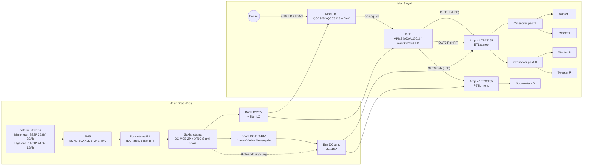
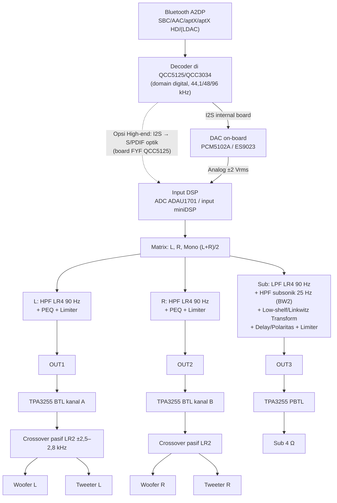

# Riset: Membangun Speaker Bluetooth Aktif DC ±400 W RMS Berbasis Modul

> **Untuk:** hobiis audio Indonesia · **Tanggal riset:** September 2026 · **Pendekatan:** modul siap pakai (tanpa desain PCB)
>
> **Konvensi label data** (dipakai di seluruh dokumen):
> - **[T]** = *terverifikasi*: angka diambil langsung dari datasheet/halaman produk/review, nomor sumber ditulis sebagai [R#] (lihat bagian 13).
> - **[E]** = *estimasi/perhitungan*: hasil rumus atau asumsi penulis. Rumus dan asumsinya selalu dicantumkan.
> - **[V]** = *perlu verifikasi*: informasi yang belum bisa dikonfirmasi dari sumber primer, atau yang berbeda-beda antar penjual. Cek sendiri sebelum membeli.
>
> Semua harga dalam Rupiah adalah **[E]**, disusun dari listing Tokopedia/Shopee/AliExpress/toko luar yang ditemukan pada 2025–2026. Untuk harga luar negeri dipakai kurs asumsi **US$1 ≈ Rp16.500** dan **€1 ≈ Rp19.000**, ditambah ongkir/bea kira-kira 15–30%.

---

## Daftar Isi

1. [Ringkasan & Rekomendasi Utama](#1-ringkasan--rekomendasi-utama)
2. [Spesifikasi Target](#2-spesifikasi-target)
3. [Arsitektur & Diagram Blok](#3-arsitektur--diagram-blok)
4. [Perhitungan Daya, Tegangan, Arus, dan Runtime](#4-perhitungan-daya-tegangan-arus-dan-runtime)
5. [Pilihan Modul: Tabel Perbandingan](#5-pilihan-modul-tabel-perbandingan)
6. [Skema Wiring](#6-skema-wiring)
7. [Driver & Enclosure](#7-driver--enclosure)
8. [Power, Baterai & Proteksi](#8-power-baterai--proteksi)
9. [BOM: Dua Varian](#9-bom-dua-varian)
10. [Perakitan](#10-perakitan)
11. [Tuning & Pengujian](#11-tuning--pengujian)
12. [Keselamatan](#12-keselamatan)
13. [Sumber/Referensi](#13-sumberreferensi)

---

## 1. Ringkasan & Rekomendasi Utama

**Kesimpulan singkat**

1. **Arsitektur: 2.1.** Dua satelit 2-way (woofer 6,5" + tweeter, crossover pasif sekitar 2,5–2,8 kHz) ditambah satu subwoofer 8–10". DSP memotong satelit di atas ±90 Hz dan subwoofer di bawahnya. Untuk speaker portabel, 2.1 lebih efisien daripada 2.0: bass di bawah ±100 Hz praktis tidak terdengar arahnya, jadi cukup satu kabinet bass yang besar, dan satelit bisa dibuat kecil.
2. **Tegangan: rail ±44–48 V.** Dengan beban 4–8 Ω, rail 12 V atau 24 V tidak bisa menghasilkan 400 W nyata. Batasnya dijelaskan oleh rumus **P = V²/(2R)** di bagian 4.
3. **Amplifier: TPA3255 (TI)**, dipakai dua board. Board #1 stereo (BTL) untuk satelit 8 Ω, board #2 mono (PBTL) untuk sub 4 Ω. Menurut datasheet TI, satu TPA3255 menghasilkan 255 W/4 Ω (BTL, 1% THD+N, 51 V) dan 315 W/4 Ω (PBTL, 1% THD+N, 53,5 V) [T][R2].
4. **Bluetooth:** modul **Qualcomm QCC5125** (aptX HD/Adaptive; LDAC tergantung firmware modul [V]) atau **QCC3034** (aptX HD). Keluarannya **analog** ke DSP. Jalur analog paling mudah dan paling bebas masalah clock. I2S langsung ke ADAU1701 tidak disarankan karena ADAU1701 hanya bisa menjadi slave yang sinkron ke MCLK-nya sendiri [T][R21][R22].
5. **DSP:** **miniDSP 2x4 HD** untuk High-end (catu 12 V DC, 10 PEQ per kanal, crossover, compressor/limiter, input optik [T][R23]). Untuk Menengah dipakai **Wondom APM2 (ADAU1701)** + programmer ICP5 dan SigmaStudio [T][R19].
6. **Baterai:** **LiFePO4** dipilih karena lebih aman daripada Li-ion NMC.
   - **High-end: 14S LiFePO4 langsung, tanpa boost.** Rentangnya 35,0–51,1 V dengan nominal 44,8 V, masih di bawah batas rekomendasi TPA3255 51 V untuk beban 4 Ω dan 53,5 V untuk beban ≥6 Ω [T][R2]. Tanpa boost berarti tidak ada rugi konversi dan tidak ada derau switching boost.
   - **Menengah: 8S LiFePO4 24 V + boost ke 48 V.** Komponen ekosistem 24 V (BMS, charger, sel) sangat umum di Indonesia.

**Kombinasi modul yang direkomendasikan**

| Blok | **Varian Menengah** (≈ Rp10–15,5 jt) [E] | **Varian High-end** (≈ Rp20–29 jt) [E] |
|---|---|---|
| Bluetooth | ZK-QCC (QCC3034 atau QCC5125) + DAC PCM5102A, catu 8–32 V [T][R31] | QCC5125 (LDAC/aptX HD) + DAC, atau QCC5125 → optik ke DSP [R29][R30][R32] |
| DSP | Wondom APM2 AA-AP23122 (ADAU1701, 2-in/4-out) + ICP5 [R19] | miniDSP 2x4 HD (2-in/4-out, 12 V, limiter) [R23] |
| Amp satelit | ZK-3002 (TPA3255) BTL stereo [R13] | 3e Audio 260-2-29A (2×TPA3255, PFFB, input balanced) [R12] |
| Amp sub | ZK-3002 (TPA3255) PBTL mono [R13] | ZK-3002 PBTL (sub tidak butuh THD ultra-rendah) |
| Power | LiFePO4 8S2P 25,6 V/30 Ah + BMS 8S + **boost 48 V** | LiFePO4 14S1P 44,8 V/15 Ah + JK BMS 40 A, **langsung** |
| Driver | 2× Dayton DC160-8 + 2× DC28FS-8 + 1× RSS210HO-4 | 2× SB Acoustics SB17NRX2C35-8 + 2× SB26STCN-C000-4 + 1× Dayton RSS265HO-4 |
| Kapasitas daya amp | 2×≈125 W (8 Ω) + ≈254 W (4 Ω) ≈ **500 W** @48 V [E] | 2×≈108 W (8 Ω) + ≈222 W (4 Ω) ≈ **440 W** @44,8 V nominal [E] |

**Alternatif ringkas (paling sedikit kabel):** Wondom **JAB5** (AA-JA33286) all-in-one: QCC3034 + ADAU1701 + amp 4 kanal, 10–39 V, mode 2.1 = 2×100 W + 1×200 W menurut pabrikan [T][R15][R16]. Hitungan di bagian 4 menunjukkan daya nyatanya (1% THD) lebih mungkin di kisaran **300–350 W** [E], jadi sedikit di bawah target 400 W.

---

## 2. Spesifikasi Target

| Parameter | Target | Catatan |
|---|---|---|
| Sumber daya | DC: baterai internal, bisa juga adaptor DC | Tidak ada tegangan AC di dalam kabinet |
| Daya | ±400 W RMS nyata (kapasitas amp @1% THD+N) | Bukan PMPO. Daya kontinu ke driver dibatasi limiter DSP sesuai rating thermal driver |
| Konfigurasi | 2.1: satelit 2-way + sub | Crossover DSP ±80–100 Hz, LR4 (24 dB/okt) |
| Input | Bluetooth 5.x aptX HD (LDAC opsional), AUX analog | Jalur analog dari modul BT ke DSP |
| Respons target | ±35 Hz – 20 kHz (−6 dB) | Sub sealed + EQ, atau ported (verifikasi di WinISD) |
| SPL maks. | ±110–115 dB @1 m (puncak) [E] | Tergantung sensitivitas driver dan ukuran box |
| Runtime | ≥8 jam volume keras, ≥24 jam volume sedang [E] | Lihat 4.5 |
| Proteksi | BMS, fuse DC-rated, anti-spark, limiter DSP, OTP/OCP internal amp | Lihat bagian 8 |

---

## 3. Arsitektur & Diagram Blok

### 3.1 Perbandingan 2.0 dan 2.1

| Aspek | **2.0 stereo (mis. 2×200 W)** | **2.1 (mis. 2×100 W + 1×200 W)** |
|---|---|---|
| Kebutuhan driver | Tiap sisi butuh woofer besar (8"+) untuk bass dalam | Satelit cukup 5–6,5"; satu sub 8–10" |
| Volume kabinet | Dua kabinet besar | Dua satelit kecil (5–10 L) + satu box sub (10–30 L) |
| Efisiensi daya | Kedua kanal harus kuat di bass | Daya besar hanya di kanal sub, satelit lebih ringan |
| Distorsi/IMD | Woofer menangani bass + vokal sekaligus | Satelit bebas ekskursi besar, sehingga vokal lebih bersih |
| Stereo image | Sedikit unggul di bass (tidak signifikan di bawah ±100 Hz) | Setara di atas crossover |
| Kompleksitas DSP | Cukup PEQ + HPF subsonik | Perlu crossover, sum mono sub, delay/phase |
| Jumlah kanal amp | 2 | 3 (atau 2 board TPA3255: 1 BTL stereo + 1 PBTL) |
| Portabilitas (boombox) | Kurang: dua kabinet berat | Baik: sub dan satelit bisa disatukan dalam satu kabinet bersekat |

**Rekomendasi: 2.1.** Untuk speaker portabel bertenaga baterai, energi paling banyak dipakai di bass. Menaruh bass di satu driver besar dalam box yang optimal lebih efisien per watt-jam daripada dua woofer kecil. Satu kabinet "boombox" bersekat (dua ruang satelit tertutup + ruang sub) juga lebih praktis dibawa.

### 3.2 Diagram blok sistem (daya + sinyal)



### 3.3 Diagram sinyal audio (I2S/analog dan crossover)



**Mengapa jalur analog, bukan I2S langsung?** Modul BT hampir selalu menjadi *I2S master*. Port serial ADAU1701 harus sinkron dengan MCLK DSP (rasio 64/256/384/512×Fs) dan tidak punya ASRC, sehingga menyambung I2S dari modul BT biasanya memaksa modifikasi clock [T][R21][R22]. Jalur analog (DAC PCM5102A/ES9023 di modul BT → ADC ADAU1701) menambah satu konversi. Namun dengan ADC ADAU1701 (SNR 100 dB, THD+N −83 dB [T][R20]), kualitasnya jauh melampaui kebutuhan speaker portabel. Untuk jalur full-digital di High-end, pakai board QCC5125 dengan output optik [T][R32] ke input TOSLINK miniDSP 2x4 HD [T][R23]. Apakah input optik miniDSP menerima sample rate BT secara asinkron masih **[V]** dan perlu dicek di manual miniDSP.

---

## 4. Perhitungan Daya, Tegangan, Arus, dan Runtime

### 4.1 Rumus dasar: kenapa tegangannya harus tinggi

Amplifier class-D BTL (bridge) mengayunkan beban dari hampir 0 sampai hampir PVDD di kedua sisinya. Tegangan puncak di speaker ≈ PVDD × k, dengan *k* ≈ 0,87–0,94 karena rugi R_DS(on) MOSFET, induktor filter, dan batas clipping. Daya sinus kontinu:

$$P = \frac{V_{rms}^2}{R} = \frac{V_{peak}^2}{2R} \approx \frac{(k \cdot PVDD)^2}{2R}$$

**Kalibrasi *k* dari datasheet TPA3255 [T][R2]:**

| Kondisi datasheet (1% THD+N) | Daya | V_peak = √(2PR) | k = V_peak/PVDD |
|---|---|---|---|
| BTL, 4 Ω, PVDD 51 V | 255 W | 45,2 V | **0,89** |
| BTL, 8 Ω, PVDD 53,5 V | 155 W | 49,8 V | **0,93** |
| PBTL, 4 Ω, PVDD 53,5 V | 315 W | 50,2 V | **0,94** |
| PBTL, 2 Ω, PVDD 51 V | 495 W | 44,5 V | **0,87** |

Perbandingan dengan pengukuran independen: Archimago mengukur Fosi V3 Mono (TPA3255, 48 V/10 A) sekitar **200 W/4 Ω dan 100 W/8 Ω pada ambang 0,1% THD+N** [T][R8]. ASR mencatat ±190 W/4 Ω dengan PSU 48 V/5 A [T][R9]. Angka ini konsisten dengan model di atas: batas 0,1% sedikit di bawah batas 1%.

**Contoh: kenapa 12 V gagal.** Dengan 12,8 V (LiFePO4 4S) ke 4 Ω BTL: P ≈ (0,89×12,8)²/(2×4) ≈ **16 W** per kanal. Untuk 400 W total dibutuhkan beban < 1 Ω atau belasan chip, jadi tidak realistis.

### 4.2 Daya per konfigurasi baterai (TPA3255, 1% THD+N, pada tegangan nominal) [E]

| Paket baterai | Rentang V (kosong–penuh) | Nominal | BTL 8 Ω | BTL 4 Ω | PBTL 4 Ω | PBTL 2 Ω | **2×BTL8 + PBTL4** | Cocok untuk TPA3255? |
|---|---|---|---|---|---|---|---|---|
| LiFePO4 4S ("12 V") | 10,0–14,6 | 12,8 | 9 | 17 | 18 | 31 | 36 W | Tidak (daya terlalu kecil) |
| Li-ion 6S | 18,0–25,2 | 21,6 | 25 | 47 | 52 | 88 | 102 W | Tidak |
| LiFePO4 8S ("24 V") | 20,0–29,2 | 25,6 | 35 | 66 | 72 | 124 | 143 W | Tidak, kecuali dengan boost |
| Li-ion 10S | 30,0–42,0 | 36,0 | 70 | 131 | 143 | 245 | 283 W | Ya; 400+ W bila beban 4 Ω + 2 Ω (2×131+245 = 508 W) |
| Li-ion 12S | 36,0–50,4 | 43,2 | 101 | 189 | 206 | 353 | **408 W** | Ya (penuh 50,4 V < 51 V) |
| **LiFePO4 14S** | 35,0–51,1 | 44,8 | 108 | 203 | 222 | 380 | **439 W** | **Ya (rekomendasi)** |
| Li-ion 13S ("48 V e-bike") | 39,0–54,6 | 46,8 | 118 | 222 | 242 | 414 | 479 W | **Tidak.** Saat penuh 54,6 V > 53,5 V (batas rekomendasi) |
| LiFePO4 16S ("48 V") | 40,0–58,4 | 51,2 | 142 | 265 | 290 | 496 | 573 W | **Tidak.** Saat penuh 58,4 V jauh di atas batas |
| Boost teregulasi 48 V | 48 (konstan) | 48 | 125 | 233 | 254 | 436 | **504 W** | Ya |

Tegangan sel: LiFePO4 nominal 3,2 V, penuh 3,65 V, cutoff 2,5 V [T][R52]; Li-ion NMC nominal 3,6–3,7 V, penuh 4,2 V, cutoff ±3,0 V (umum). Batas PVDD TPA3255 menurut *Recommended Operating Conditions*: 18–51 V untuk R_L = 4 Ω dan 18–53,5 V untuk R_L ≥ 6 Ω [T][R2].

**Catatan penting 14S:** penuh 51,1 V hanya sedikit di atas 51 V (batas untuk 4 Ω), dan board 3e 260-2-29A dirating 36–51 V [T][R12]. **Isi baterai sampai 3,55–3,60 V/sel (49,7–50,4 V)** dengan charger CC/CV yang bisa disetel. Tegangan istirahat LiFePO4 juga cepat turun ke ±3,35 V/sel (±47 V). Setel **pemutus tegangan rendah di 2,7 V/sel = 37,8 V** agar tetap di atas batas bawah 36 V board 3e.

### 4.3 Opsi (a) Baterai 12/24 V + boost, dibandingkan opsi (b) baterai langsung

| Kriteria | (a1) 12 V + boost 48 V | (a2) **24 V + boost 48 V** | (b) **14S LiFePO4 langsung** | (b') Li-ion 10S/12S langsung |
|---|---|---|---|---|
| Arus input @400 W out (sinus kontinu) [E] | ≈ 499 W / 12,8 V ≈ **39 A** (47 A @10,5 V) | ≈ 499 W / 25,6 V ≈ **19,5 A** (22 A @22,4 V cutoff) | ≈ 467 W / 44,8 V ≈ **10,4 A** (12,4 A @37,8 V) | 10S: ≈ 13 A; 12S: ≈ 11 A |
| Efisiensi berantai [E] | amp 0,88 × boost ±0,90 (arus tinggi) ≈ 0,79 | amp 0,88 × boost ±0,93 ≈ 0,82 | amp 0,88 (tanpa boost) | 0,88 |
| Kemampuan boost "1200 W" murah | Di 12 V input maks. ±**360 W** (arus input maks. 30 A) [T][R36]. **Tidak cukup** | Di 24 V ±**600 W** (arus input maks. 25 A) [T][R36]. Cukup | Tidak perlu | Tidak perlu |
| Daya vs SoC baterai | Konstan (teregulasi) | Konstan | Turun ±30% saat baterai hampir habis [E] | Turun ±40–50% (rentang V lebar) |
| Derau | Ripple switching boost 150 kHz; butuh filter dan grounding rapi | Sama | Paling bersih | Paling bersih |
| Ekosistem di Indonesia | Sangat umum | **Sangat umum** (charger 29,2 V, BMS 8S) [R54][R56] | Charger 14S 51,1 V lebih jarang [V]; ada di AliExpress/produsen [R56] | Pack 12S jarang; 13S (tidak cocok) paling umum |
| Keamanan kimia | LiFePO4 aman | LiFePO4 aman | LiFePO4 aman | NMC: risiko thermal runaway lebih tinggi [R60] |
| Ukuran kabel utama | 8 AWG | 10–12 AWG | 12–14 AWG | 12–14 AWG |
| **Kesimpulan** | Tidak disarankan | **Menengah** | **High-end** | Alternatif bila paham Li-ion |

### 4.4 Arus per cabang (untuk fuse dan kabel) [E]

Asumsi: efisiensi amp η ≈ 0,88 (TI: 90% @4 Ω [T][R1]), boost 0,93, idle total 10–12 W.

| Cabang | Varian Menengah (bus 48 V) | Varian High-end (bus 44,8 V; min 37,8 V) |
|---|---|---|
| Amp satelit (2×125 / 2×108 W) | 250/0,88 = 284 W → **5,9 A** | 216/0,88 = 245 W → **5,5 A** (6,5 A @37,8 V) |
| Amp sub (254 / 222 W) | 289 W → **6,0 A** | 252 W → **5,6 A** (6,7 A @37,8 V) |
| DSP + BT (via buck) | ±5 W → 0,2 A di 24 V | ±5 W → 0,12 A di 44,8 V |
| **Total dari baterai (sinus penuh)** | ≈ 499 W → **19,5 A @25,6 V** / 24,9 A @20 V | ≈ 467 W → **10,4 A @44,8 V** / 12,4 A @37,8 V |
| Musik keras (rata-rata ±50 W audio) | ≈ 71 W → 2,8 A | ≈ 69 W → 1,5 A |

Catatan: musik punya *crest factor* (rasio puncak/rata-rata) besar. Pada volume "sangat keras tapi belum clipping", daya rata-rata biasanya hanya ±1/8 dari daya maksimum [E, aturan praktis]. Puncak transien dipasok kapasitor bulk di board amp. Karena itu fuse dipilih dari arus sinus penuh, bukan dari rata-rata.

### 4.5 Runtime [E]

$$t\,[jam] \approx \frac{E_{baterai}\,[Wh] \times 0{,}9\ (DoD\ aman)}{P_{input\ rata\text{-}rata}\,[W]}$$

| Paket | Energi | Keras (P_in ≈ 70 W) | Sedang (P_in ≈ 23–25 W) | Sinus penuh (uji, ±470–500 W) |
|---|---|---|---|---|
| Menengah 8S2P 32140 15 Ah (25,6 V, 30 Ah) | 768 Wh | **±9–10 jam** | **±27–30 jam** | ±1,4 jam |
| High-end 14S1P 32140 15 Ah (44,8 V, 15 Ah) | 672 Wh | **±8,5 jam** | **±24 jam** | ±1,3 jam |
| High-end 14S2P (30 Ah) | 1.344 Wh | ±17 jam | ±48 jam | ±2,6 jam |

---

## 5. Pilihan Modul: Tabel Perbandingan

### 5.1 Chip/modul amplifier class-D

| Chip | Rentang PVDD | Daya per datasheet | THD+N / noise | Idle | Panas & heatsink | Status untuk target 400 W |
|---|---|---|---|---|---|---|
| **TI TPA3255** | 18–53,5 V (51 V untuk 4 Ω) [T][R2] | BTL: 255 W/4 Ω @51 V, 155 W/8 Ω @53,5 V (1%); PBTL: 495 W/2 Ω @51 V, 315 W/4 Ω @53,5 V (1%) [T][R2] | 0,006% @1 W/4 Ω; noise <85 µV; SNR >111 dB [T][R1] | <2,5 W [T][R2] | Kemasan pad-up (HTSSOP-44 DDV), **wajib heatsink atas**; data termal diukur dengan heatsink 85 °C [T][R2]. Board biasanya pakai heatsink besar + kipas | **Pilihan utama** |
| TI TPA3251 | 12–36 V [T][R3] | BTL 140 W/4 Ω, 175 W/3 Ω; PBTL 285 W/2 Ω (1%, 36 V) [T][R3] | 0,005% @1 W; noise <60 µV [T][R3] | Rendah | Heatsink wajib | Bisa: 2×140 (4 Ω) + 285 (2 Ω) ≈ 565 W, tapi butuh beban 4 Ω/2 Ω dan rail 36 V teregulasi (Li-ion 10S penuh 42 V melebihi batas) |
| TI TPA3221 | 7–30 V [T][R5] | 2×105 W/4 Ω; 1×208 W/2 Ω PBTL [T][R5] | Loop feedback 100 kHz; idle <0,25 W (mode HEAD) [T][R5] | **Sangat rendah** | Heatsink sedang | Terbatas: 2×105 + 208 ≈ 420 W hanya dengan 3 chip & beban 4/2 Ω di 30 V. Punya proteksi DC speaker bawaan |
| TI TPA3116D2 | 4,5–26 V [T][R4] | 2×50 W/4 Ω @21 V; 100 W/2 Ω PBTL [T][R4] | 0,1% @1 kHz [T][R4] | Rendah | Heatsink kecil | **Tidak cukup** (butuh 4 chip PBTL 2 Ω untuk 400 W); cocok untuk proyek 50–200 W |
| TI TAS5630B | 25–52,5 V [T][R6] | 2×300 W BTL; 400 W PBTL (10% THD) [T][R6] | 0,03% @1 W/4 Ω; SNR >100 dB [T][R6] | Lebih tinggi | Heatsink besar; butuh catu 12 V terpisah untuk GVDD | Generasi lama (PurePath HD). Masih aktif, tetapi THD kalah dari TPA3255 |
| Infineon MA12070 | 4–26 V [T][R7] | 2×80 W/4 Ω @26 V (10% THD, puncak) [T][R7] | 0,004% (klaim); efisiensi >91% @8 Ω [T][R7] | **<160 mW** @26 V [T][R7] | Sangat ringan | **Tidak cukup** untuk 400 W (rail maks. 26 V). Unggul untuk runtime (idle sangat kecil). Varian MA12070P punya input I2S |
| Infineon MA12040 | ≤26 V [V] | Lebih kecil dari MA12070 [V] | Tidak diverifikasi | Rendah | Ringan | Tidak cocok |

### 5.2 Board amplifier siap pakai (TPA3255)

| Board | Konfigurasi | Catu | Klaim daya | Fitur | Harga [E] |
|---|---|---|---|---|---|
| **ZK-3002** (Wuzhi/ZK) | BTL 2 kanal atau PBTL mono (bisa dipilih) [T][R13] | 18–50 V (batas 53 V); sarankan 36–48 V ≥10 A [T][R13] | BTL 2×300 W/4 Ω @50 V; PBTL 600 W/2 Ω @50 V (klaim penjual, kemungkinan 10% THD) [R13] | Gain depan 26–36 dB bisa disetel, kipas berkontrol suhu [R13] | ±Rp600–800 rb (Tokopedia) [R14] |
| **3e Audio 260-2-29A** | Stereo, **2× TPA3255** (tiap kanal PBTL), **PFFB** [T][R12] | 36–51 V [T][R12] | 2×260 W/4 Ω, 2×150 W/8 Ω @1% THD+N [T][R12] | Input XLR + RCA, THD+N 0,0007%, noise 18 µV, Zout 10 mΩ [T][R12] | €149 → ±Rp2,8–3,3 jt |
| 3e Audio TPA3255-2CH-260W | Stereo BTL saja [T][R11] | 24–51 V, UVP 24 V [T][R11] | 260 W/4 Ω @1%; 150 W/8 Ω [T][R11] | Output AUX 12 V/0,2 A untuk DSP [T][R11] | [V] |
| BDM8 / "TPA3255 2.0" generik | BTL stereo | 19–48 V [R14] | 2×300 W (klaim) | Beberapa varian punya BT 5.x on-board | ±Rp750 rb–1 jt [R14] |

**Catatan kualitas:** PFFB (*post-filter feedback*) membuat respons frekuensi tidak bergantung beban dan impedansi output sangat rendah (±10 mΩ) [T][R10]. Pengaruhnya paling terasa di satelit (tweeter/woofer 8 Ω). Untuk sub, board ZK-3002 non-PFFB sudah memadai.

### 5.3 Modul Bluetooth

| Modul/chip | BT | Codec | Output | Catu | Catatan | Harga [E] |
|---|---|---|---|---|---|---|
| **ZK-QCC (QCC3034 atau QCC5125)** | 5.0 / 5.1 | SBC, AAC, aptX, aptX LL, aptX HD; **LDAC hanya versi QCC5125** [T][R31] | Analog (PCM5102A) + header I2S; USB-C sound card (QCC5125) [T][R31] | **DC 8–32 V** [T][R31] | SNR 112 dB (klaim) [R31]; bisa langsung dari bus 12 V/24 V | ±Rp350–700 rb [E] |
| QCC5125 → I2S (Audiophonics) | 5.0 | aptX, aptX HD, aptX Adaptive, LDAC [T][R29] | **I2S** (pad solder) | 5 V [T][R29] | Modul "SJR-BTM525"; pinout dari datasheet chip [R29] | €32,90 |
| QCC5125 + ES9023 (Audiophonics) | 5.1 | aptX, aptX HD, LDAC [T][R30] | Analog RCA [T][R30] | 5 V DC / 7–12 V AC [T][R30] | Ukuran 52×35 mm | €32,90 |
| FYF QCC5125 digital board | 5.1 | s.d. LDAC [T][R32] | Optik/koaksial/AES 192k/24; I2S 384k/32 [T][R32] | [V] | Jalur full-digital ke miniDSP (TOSLINK) | US$39–50 |
| Qualcomm QCC3040 (Arylic B50/BP50) | 5.2 | aptX HD, aptX Adaptive, AAC [T][R26] | Produk jadi | – | Referensi chip; modul DIY-nya jarang | – |

**Tentang LDAC:** di halaman resmi Qualcomm, QCC5125 disebut mendukung aptX/aptX HD/aptX LL/aptX Adaptive/AAC/SBC serta antarmuka I2S/PCM/SPDIF [T][R27]. **LDAC (codec Sony) tidak tercantum di sana**; dukungan LDAC berasal dari firmware pembuat modul [V]. QCC3034 mendukung aptX HD tetapi tidak Adaptive [T][R28]. Untuk iPhone (AAC saja) semua modul di atas setara.

**Noise dan ground loop:** masalah paling umum pada speaker BT + class-D yang berbagi satu catu adalah dengung/"cuit" saat modul BT aktif. Arus burst radio BT dan arus besar amp mengalir lewat ground sinyal. Solusi yang terbukti di diyAudio: catu BT lewat **DC-DC terisolasi** atau regulator + filter sendiri, **ground bintang**, kapasitor bypass tepat di pin 5 V/GND modul, atau trafo isolasi audio [T][R33][R34][R35]. *Ground loop isolator* murah bisa menghilangkan dengung tetapi dilaporkan mengurangi bass [T][R33]. Lihat 8.8.

### 5.4 DSP

| DSP | I/O | Catu | Fitur | Pemrograman | Harga [E] |
|---|---|---|---|---|---|
| **Wondom APM2 (AA-AP23122)**, ADAU1701 | 2 in / 4 out analog; ADC/DAC 24-bit 48 kHz; DR 98,5 dB [T][R19] | **5 V USB-C** [T][R19] | Apa pun yang bisa dibuat di SigmaStudio: crossover, PEQ, **limiter/compressor**, bass enhancement, delay. 4 potensiometer on-board [T][R19] | SigmaStudio via **ICP5** atau USBi; EEPROM self-boot | ±Rp400–600 rb + ICP5 ±Rp400–600 rb |
| ADAU1701 (chip) | 2 ADC (SNR 100 dB, THD+N −83 dB), 4 DAC (SNR 104 dB, THD+N −90 dB) [T][R20] | 3,3 V | 28/56-bit, 50 MIPS [T][R20] | SigmaStudio | – |
| **miniDSP 2x4 HD** | 2 in (analog/USB/TOSLINK), 4 out analog; maks. 2 Vrms [T][R23] | **12 V DC**, ±2,5 W; tidak bisa dicatu USB [T][R23] | 10 PEQ per input & output, crossover, delay s.d. 80 ms, **soft-limit compressor**, 2048 tap FIR [T][R23] | GUI miniDSP (Windows/macOS) | ±US$225–250 → ±Rp4–5,5 jt |
| Dayton Audio DSP-408 (ADAU1701) | 4 in / 8 out RCA; input maks. 3,2 V [T][R24] | **9–17 V** (adaptor 12 V/1,5 A) [T][R24] | PEQ 10 band/kanal; crossover LR/BW/Bessel s.d. 24 dB/okt; delay. **Limiter tidak tercantum** di spesifikasi [T][R24] | GUI Windows + opsi BT | US$199,98 [T][R24] |
| Arylic (ACPWorkbench) | Tertanam di board Up2Stream | – | EQ 10 band, virtual bass, noise suppressor, konfigurasi kanal [T][R25] | ACPWorkbench (Windows) | – |

### 5.5 Board all-in-one (BT + DSP + amp)

| Board | Isi | Catu | Daya (klaim) | Kelebihan | Kekurangan |
|---|---|---|---|---|---|
| **Wondom JAB5 (AA-JA33286)** | BT 5.0 **QCC3034** (aptX HD), **ADAU1701**, amp 4 kanal [T][R15][R16] | **10–39 V** [T][R15] | 4×100 W/6 Ω; 2.1: 2×100 W + 1×200 W; 2.0: 2×200 W/4 Ω [T][R15] | Paling ringkas; SigmaStudio; input line + I2S; bisa di-cascade [T][R15] | IC amp **tidak dipublikasikan resmi** (satu reseller menyebut "TDA749x") [V][R16]. Beban min. 6 Ω per kanal. Daya nyata @1% di 36 V ±70–87 W/kanal (6–8 Ω) [E]. SNR 97 dB [T][R15] |
| Wondom JAB3+ (AA-JA32173) | BT 5.0 aptX HD + ADAU1701, 2×50 W/4 Ω [T][R18] | [V] | 2×50 W | Bisa dicatu baterai [R18] | Daya kecil |
| Wondom JAB4 (AA-JA33285) | **TPA3118** 4×30 W/8 Ω + ADAU1701 + BT 5.0 [T][R17] | [V] | 4×30 W | Cocok untuk 4-way aktif kecil | Daya kecil |
| Arylic Up2Stream Amp 2.1 | WiFi + BT 5.0 + DSP; 2×50 W + 100 W [T][R25] | [V] | 200 W | Streaming WiFi/AirPlay; LPF sub 50–200 Hz (default 110 Hz) [T][R25] | Daya kecil |
| ZK-TB21 | 2× TPA3116D2, BT 5.0, 2×50 W + 100 W | 12–24 V | 200 W (klaim) | Murah | Tidak ada DSP sejati (hanya tone control); daya jauh di bawah target |

### 5.6 Rekomendasi kombinasi terbaik

| Tujuan | Kombinasi |
|---|---|
| **Kualitas terbaik per rupiah (Menengah)** | ZK-QCC (QCC5125) → **APM2 ADAU1701** → 2× **ZK-3002** (BTL + PBTL) @48 V dari boost |
| **Kualitas tertinggi (High-end)** | QCC5125 (analog ES9023/PCM5102A, atau optik) → **miniDSP 2x4 HD** → **3e 260-2-29A** (satelit) + **ZK-3002 PBTL** (sub) @14S LiFePO4 |
| **Paling mudah/ringkas** | **Wondom JAB5** + LiFePO4 8S + boost ke **35 V** (margin di bawah 39 V). Target daya turun menjadi ±300–350 W |
| **Upgrade full-aktif 5 kanal** | Dayton DSP-408 (8 out) + amp ketiga untuk tweeter. Crossover pasif dihapus, tetapi limiter harus dicek dulu [V] |

---

## 6. Skema Wiring

### 6.1 Wiring daya: Varian High-end (14S LiFePO4 langsung)

```text
 ┌──────────────────────── PAKET BATERAI ─────────────────────────┐
 │ LiFePO4 32140 15Ah × 14 seri (14S1P)                            │
 │ Nominal 44,8V │ Penuh 51,1V (isi s.d. 50,4V) │ Cutoff 37,8V      │
 │ Sel: 3,2V nom / 3,60V isi / 2,70V cutoff                        │
 └───┬──────────────────────────────────────────────────────────┬───┘
     │B+                                                        │B−
     │                                     ┌────────────────────┴──────────┐
     │                                     │ BMS JK-BD4A24S4P (8–24S, 40A) │
     │                                     │ OVP 3,60V/sel  UVP 2,70V/sel  │
     │                                     │ OCP ~30A  NTC di paket        │
     │                                     └────────────────────┬──────────┘
     │                                                          │P− (12 AWG)
 [F1] MAXI 58V 25A  (≤15 cm dari B+, 12 AWG)                    │
     │                                                          │
 (XT90-S anti-spark) ◄── konektor pack, bisa dilepas              │
     │                                                          │
 [SW1] DC MCB 2P 32A ≥63VDC  (atau saklar DC + relay precharge)  │
     │ 12 AWG                                                   │
     ▼                                                          ▼
 ═══ BUS+ 44,8V (35–51V) ═══════════════╗         ═══ STAR GROUND (satu titik, busbar) ═══
     │            │            │         ║              ▲        ▲        ▲        ▲
   [F2]         [F3]         [F4]        ║              │        │        │        │
  MINI 58V     MINI 58V     MINI 58V     ║              │        │        │        │
    15A          15A          3A         ║              │        │        │        │
     │14AWG       │14AWG       │20AWG     ║              │        │        │        │
     ▼            ▼            ▼         ║              │        │        │        │
 ┌─────────┐ ┌─────────┐ ┌───────────────┐              │        │        │        │
 │AMP #1   │ │AMP #2   │ │BUCK 45V→12V 3A│─12V──[F5 1A]─┼──┐     │        │        │
 │3e 260-  │ │ZK-3002  │ │(isolated pref)│              │  │     │        │        │
 │2-29A    │ │PBTL     │ │ + LC 10µH/    │              │  ▼     │        │        │
 │36–51V   │ │18–50V   │ │  470µF        │              │ miniDSP│        │        │
 │≈5,5A    │ │≈5,6A    │ └──────┬────────┘              │ 2x4 HD │        │        │
 │(6,5A    │ │(6,7A    │        │GND                    │ 12V    │        │        │
 │ @37,8V) │ │ @37,8V) │        │                       │ 0,21A  │        │        │
 └┬──┬──┬──┘ └┬──┬──┬──┘        │                       │        │        │        │
  │  │  │GND  │  │  │GND        │    12V─[F6 0,5A]─► ZK-QCC (8–32V, ±0,1A)│        │
  │  │  └─────┼──┼──┴───────────┴────────────────────────┴────────┴────────┴────────┘
  │  │ 14AWG  │  │ 14AWG     (tiap modul punya kabel GND SENDIRI ke star, jangan diserikan)
  │  │        │  │
 L+ L−  R+ R− SUB+ SUB−   ← output BTL/PBTL: KEDUA terminal "hidup", JANGAN ke GND/chassis
  │  │   │  │   │   │
 16AWG 16AWG  14AWG
  ▼  ▼   ▼  ▼   ▼   ▼
 XO-L   XO-R   SUB 4Ω (RSS265HO-4)

 Charger: CC/CV 14S LiFePO4, set 50,4V, 3–5A → port charge (XT60) → BMS (common-port)
 Indikator: voltmeter/kapasitas 10–100V di BUS+ setelah SW1 (arus ~10 mA)
 Kipas 12V PWM + termostat (heatsink amp) dari rail 12V, fuse 1A
```

**Perhitungan fuse dan kabel [E]:**
- **F1 25 A / 12 AWG.** Arus sinus penuh maks. 12,4 A @37,8 V. Kabel 12 AWG dirating 41 A untuk *chassis wiring* [T][R57], jadi fuse 25 A melindungi kabel dan tidak putus karena transien.
- **F2/F3 15 A / 14 AWG.** Tiap amp maks. ±6,7 A kontinu; 14 AWG dirating 32 A *chassis* [T][R57].
- **Fuse wajib dirating tegangan DC ≥ tegangan sistem.** Fuse blade mobil standar umumnya dirating 32 V DC. Untuk bus 44,8–51 V pakai seri **58 V** (Littelfuse MAXI 58 V / MINI 58 V / TAC ATO 58 V) [T][R58].
- **Drop tegangan:** 12 AWG = 5,21 Ω/km [T][R57]. Kabel 1 m pulang-pergi pada 12 A = 0,0625 V (0,14%), bisa diabaikan.

### 6.2 Wiring daya: Varian Menengah (8S LiFePO4 + boost 48 V)

```text
 LiFePO4 32140 15Ah, 8S2P → 25,6V nom (20,0–29,2V), 30Ah, 768Wh
     │B+                                                   │B−
     │                                   BMS 8S 60A (Daly/JK-BD4A8S4P 40A)
 [F1] MAXI 32V/58V 40A (≤15 cm)                            │P− (10 AWG)
     │ 10 AWG                                              │
 (XT90-S) → [SW1] DC MCB 2P 40A                            │
     │ 10 AWG  (arus input boost s.d. ~25A pada 400W sinus) │
     ├────────────────────────────┐                        │
     ▼                            ▼                        │
 ┌─────────────────────────┐   [F4 2A]─ BUCK 24V→5V 3A + LC ─► APM2 (5V USB-C)
 │ BOOST DC-DC 1200W/20A   │      │                        │
 │ In 10–60V (maks 25–30A) │   [F5 0,5A] + LC ─────────► ZK-QCC (8–32V, langsung 24V)
 │ Out set 48,0V           │                               │
 │ fsw 150 kHz, kipas      │                               │
 │ UVP input set 22,4V     │                               │
 └───┬─────────────────┬───┘                               │
     │ OUT+ 48V         │ OUT− (= IN−, non-isolated)       │
     │ + kapasitor 2200µF/63V low-ESR + ferit/LC opsional   │
   ┌─┴───────┐                                             │
 [F2] 15A  [F3] 15A   (MINI/MAXI 58V; 14 AWG)              │
   │          │                                            │
 ZK-3002#1  ZK-3002#2                                      │
 BTL 2×8Ω   PBTL 4Ω                                        │
 ≈5,9A      ≈6,0A                                          │
   │GND       │GND                                         │
   └──────────┴──────────── STAR GROUND (di terminal OUT− boost) ◄───┘
```

**Catatan boost:** modul "1200 W" hanya sanggup ±600 W pada input 24 V dan ±360 W pada input 12 V, karena dibatasi arus input 25–30 A [T][R36]. Setel **UVP input di 22,4 V (2,8 V/sel)** supaya boost berhenti sebelum BMS memutus. Modul menyarankan pendinginan tambahan bila arus output >15 A [T][R36].

### 6.3 Tabel koneksi antar-modul: Varian High-end

| # | Dari (modul, konektor/pin) | Ke (modul, konektor/pin) | Sinyal / level | Kabel | Catatan |
|---|---|---|---|---|---|
| 1 | Baterai B+ → F1 → XT90-S → SW1 | BUS+ busbar | 35–51 V DC | 12 AWG silikon | Fuse ≤15 cm dari sel |
| 2 | BMS P− | Star ground busbar | 0 V | 12 AWG | Satu-satunya titik 0 V utama |
| 3 | BUS+ → F2 15 A | 3e 260-2-29A VIN+ | 36–51 V [T][R12] | 14 AWG | GND board → star (14 AWG) |
| 4 | BUS+ → F3 15 A | ZK-3002 VIN+ | 18–50 V [T][R13] | 14 AWG | Mode PBTL: set jumper/switch sesuai manual [V] |
| 5 | BUS+ → F4 3 A | Buck 45→12 V (input) | 35–51 V | 18–20 AWG | Pilih buck dengan input ≥60 V |
| 6 | Buck 12 V → F5 1 A | miniDSP 2x4 HD DC in | 12 V, ±0,21 A [T][R23] | 20 AWG + jack DC | Polaritas jack **[V]** (cek manual) |
| 7 | Buck 12 V → F6 0,5 A | ZK-QCC P3 (power) | 8–32 V [T][R31] | 22 AWG | Tambah LC 10 µH + 470 µF di pin |
| 8 | ZK-QCC P1 **LGL / LGR / GND** [T][R31] | miniDSP IN1 (L) / IN2 (R), RCA | Analog ±2,1 Vrms (PCM5102A) [E] | Kabel RCA berpelindung ≤30 cm | Jumper input miniDSP ke rentang lebih tinggi bila ada [V] |
| 8b | (Opsi) FYF QCC5125 optik out | miniDSP TOSLINK in | S/PDIF ≤192k/24 [T][R32] | Kabel optik | Jalur full-digital |
| 9 | miniDSP **OUT1** | 3e 260-2-29A input L (RCA) | Maks. 2 Vrms [T][R23]; board jenuh di 1,4 Vrms RCA [T][R12] | RCA | Batasi output DSP ≤ −3 dB (lihat 11.4) |
| 10 | miniDSP **OUT2** | 3e 260-2-29A input R (RCA) | idem | RCA | – |
| 11 | miniDSP **OUT3** | ZK-3002 input (kanal yang dipakai PBTL) | ≤2 Vrms | RCA | Kanal input PBTL mengikuti manual board [V] |
| 12 | miniDSP OUT4 | (cadangan) | – | – | Bisa untuk sub kedua atau output line |
| 13 | 3e OUT **L+ / L−** | Crossover pasif L (input +/−) | ≤ ±30 Vrms | 16 AWG | **L− bukan ground** |
| 14 | 3e OUT **R+ / R−** | Crossover pasif R | idem | 16 AWG | – |
| 15 | ZK-3002 PBTL **OUT+ / OUT−** | RSS265HO-4 (+/−) | ≤ ±32 Vrms | 14 AWG | Terminal output PBTL sesuai silkscreen [V] |
| 16 | Crossover L: W+/W−, T+/T− | SB17NRX2C35-8 L, SB26STCN L | – | 16/18 AWG | Polaritas tweeter mengikuti simulasi (LR2 → tweeter dibalik) |
| 17 | Kipas 12 V + termostat 45 °C | Heatsink amp | 12 V ±0,2 A | 22 AWG | – |

### 6.4 Tabel koneksi antar-modul: Varian Menengah

| # | Dari | Ke | Sinyal / level | Catatan |
|---|---|---|---|---|
| 1 | ZK-QCC P1 LGL/LGR/GND | APM2 ADC IN L/R (lewat APM3 atau header 10-pin) [T][R19] | Analog ±2 Vrms | Konektor APM2/APM3 sesuai datasheet [V] |
| 2 | APM2 DAC OUT0/OUT1 | ZK-3002 #1 IN L/R | DAC ADAU1701 ±0,9 Vrms FS [V] | Gain ZK-3002 disetel ±30–32 dB (lihat 11.4) |
| 3 | APM2 DAC OUT2 | ZK-3002 #2 IN (PBTL) | idem | – |
| 4 | APM2 DAC OUT3 | cadangan / line out | – | – |
| 5 | ICP5 | APM2 **J11** (PH 6-pin 2 mm) [T][R19] | I2C pemrograman | Lepas setelah program ditulis ke EEPROM |
| 6 | Buck 5 V | APM2 **J2** USB-C 5 V [T][R19] | 5 V | Beri filter LC |
| 7 | BUS 24 V | ZK-QCC P3 | 8–32 V [T][R31] | Fuse 0,5 A + LC |
| 8 | Boost OUT 48 V | ZK-3002 #1 & #2 VIN | 48 V | 14 AWG, fuse 58 V 15 A masing-masing |

---

## 7. Driver & Enclosure

### 7.1 Parameter driver (data pabrikan)

| Driver | Peran | Z | Re | Fs | Qts | Vas | Xmax | Sens. (2,83 V/1 m) | RMS | Sumber |
|---|---|---|---|---|---|---|---|---|---|---|
| **Dayton RSS265HO-4** (10") | Sub High-end | 4 Ω | 3,5 Ω | 26,9 Hz | 0,35 | 29,4 L | 12,3 mm | 87,2 dB | 600 W | [T][R39] |
| **Dayton RSS210HO-4** (8") | Sub Menengah | 4 Ω | 3,6 Ω | 29,6 Hz | 0,40 | 18,7 L | 11 mm | 85,7 dB | 300 W | [T][R38] |
| Dayton DCS205-4 (8") | Sub hemat | 4 Ω | – | 32,3 Hz | 0,37 | 27 L | 8,8 mm | 88,6 dB | 150 W | [T][R40] |
| **SB Acoustics SB17NRX2C35-8** (6,5") | Woofer satelit High-end | 8 Ω | 5,7 Ω | 36,5 Hz | 0,42 | 27 L | ±5,5 mm (coil 16 mm − gap 5 mm)/2 | 87 dB | 50 W (IEC) | [T][R43] |
| Dayton RS180-8 (7") | Alternatif woofer High-end | 8 Ω | 6,4 Ω | 35,7 Hz | 0,31 | 24,4 L | 6 mm | 87,1 dB | 60 W | [T][R37] |
| **Dayton DC160-8** (6,5") | Woofer satelit Menengah | 8 Ω | 6,6 Ω | 35,7 Hz | 0,34 | 17,9 L | 3,15 mm | 86,1 dB | 50 W | [T][R41] |
| **SB Acoustics SB26STCN-C000-4** | Tweeter High-end | 4 Ω | 3,2 Ω | 960 Hz | – | – | – | 92,5 dB | 120 W maks. | [T][R44] (crossover rekomendasi ≥2,6 kHz/12 dB) |
| **Dayton DC28FS-8** | Tweeter Menengah | 8 Ω | – | 813 Hz | – | – | – | 89 dB (1 W/1 m) | 50 W RMS | [T][R42] (crossover ≥1,8 kHz) |

**Kecocokan impedansi dengan amp:**
- **Satelit 8 Ω + TPA3255 BTL.** Di 44,8–48 V menghasilkan ±108–125 W per kanal [E], cukup untuk woofer 50–60 W RMS plus headroom transien. Dengan 8 Ω arus lebih kecil, amp lebih dingin, dan batas 53,5 V (R_L ≥6 Ω) berlaku [T][R2].
- **Sub 4 Ω + TPA3255 PBTL.** ±222–254 W [E]. Untuk RSS210HO-4 (300 W) aman tanpa limiter thermal; untuk DCS205-4 (150 W) **wajib limiter** (lihat 11.4). Sub DVC 2×4 Ω (mis. RSS265HO-44) bisa diparalel menjadi 2 Ω untuk ±380 W di 44,8 V, tetapi arus dan panas naik.
- **JAB5:** minimal 6 Ω per kanal [T][R15], jadi pakai woofer 8 Ω.

**Merek lokal (ACR, Black Spider, Audax lokal):** banyak driver lokal dirancang untuk *sound system*/PA dan mobil: sensitivitas tinggi, Qts tinggi, Xmax kecil, dan data T/S sering tidak lengkap. Contoh data resmi **ACR 10" 25H100SUWPP Curve**: Fs 45 Hz, **Qts 1,24**, Vas 83,5 L, **Xmax 2,8 mm**, 90 dB, "300 W" maks. [T][R45]. Qts setinggi itu cocok untuk open-baffle/box sangat besar, bukan sub box kecil yang di-EQ. Jadi untuk sub portabel, pilih driver dengan **Qts 0,3–0,45 dan Xmax ≥8 mm**. Driver lokal masih bisa dipakai untuk satelit PA, asalkan T/S-nya diukur sendiri (REW + jig impedansi atau DATS) [V].

### 7.2 Sealed vs ported

| Aspek | Sealed (tertutup) | Ported (bass reflex) | Passive radiator |
|---|---|---|---|
| Ukuran untuk F3 yang sama | Lebih besar bila tanpa EQ, **kecil bila di-EQ** | Lebih kecil/efisien di sekitar Fb | Kecil |
| Efisiensi di sekitar Fb | Rendah | +3–6 dB di sekitar Fb | Mirip port |
| Respons transien / group delay | Terbaik | Lebih lambat di sekitar Fb | Mirip port |
| Proteksi di bawah Fb | Driver tetap "terkontrol" | Driver bebas bergerak, **wajib HPF subsonik** | Wajib HPF |
| Noise port (chuffing) | Tidak ada | Ada bila port kecil | Tidak ada |
| Toleransi salah hitung | Tinggi | Rendah (harus pas di WinISD) | Sedang |
| Cocok dengan amp 250 W + DSP | **Sangat cocok** (Linkwitz transform) | Cocok bila box cukup besar | Cocok, biaya tambah |

**Rekomendasi:** satelit **sealed** karena HPF 90 Hz ada di DSP. Sub **sealed + EQ** untuk kabinet kompak, atau **ported** bila ruang box ≥25–30 L dan port bisa panjang (verifikasi di WinISD).

### 7.3 Menghitung volume box sealed

Rumus (Thiele/Small, box tertutup):

$$V_b = \frac{V_{as}}{(Q_{tc}/Q_{ts})^2 - 1} \qquad f_c = F_s \cdot \frac{Q_{tc}}{Q_{ts}} \qquad Q_{tc} = Q_{ts}\sqrt{\frac{V_{as}}{V_b}+1}$$

| Driver | Vb untuk Qtc 0,707 | fc | Vb untuk Qtc 0,6 | fc | Usulan praktis [E] |
|---|---|---|---|---|---|
| RSS265HO-4 | 9,5 L | 54 Hz | 15,2 L | 46 Hz | **15 L bersih** → Qtc 0,60, fc 46 Hz; + Linkwitz transform ke ±30 Hz |
| RSS210HO-4 | 8,8 L | 52 Hz | 15,0 L | 44 Hz | **12–15 L** |
| DCS205-4 | 10,2 L | 62 Hz | 16,6 L | 52 Hz | 12 L → Qtc 0,67, fc 58 Hz |
| SB17NRX2C35-8 | 14,7 L | 61 Hz | 25,9 L | 52 Hz | **10 L** → Qtc 0,81, fc 70 Hz (aman karena HPF 90 Hz) |
| DC160-8 | 5,4 L | 74 Hz | 8,5 L | 63 Hz | **6 L** → Qtc 0,68, fc 71 Hz |
| RS180-8 | 5,8 L | 81 Hz | 8,9 L | 69 Hz | 6 L → Qtc 0,70, fc 80 Hz |

"Vb bersih" = volume dalam dikurangi volume driver, bracing, dan port. Tambahkan ±10–15% bila box diisi damping (damping membuat box "terasa" lebih besar).

### 7.4 Menghitung port (bila ported)

$$L_v\,[cm] = \frac{23562{,}5 \cdot D_v^2 \cdot N_p}{F_b^2 \cdot V_b} - k \cdot D_v$$

dengan Dv = diameter port (cm), Vb (liter), Fb (Hz), Np = jumlah port, k = 0,732 (satu ujung flanged), 0,85 (dua ujung flanged), 0,614 (dua ujung bebas) [T][R46].

Contoh [E]: RSS265HO-4, Vb 30 L, Fb 32 Hz, port Ø7,5 cm, 1 buah → **Lv ≈ 37,7 cm**. Untuk 250 W di 32 Hz, port Ø7,5 cm kemungkinan besar terlalu kecil (kecepatan udara tinggi, terdengar "chuffing"). Cek grafik *Air velocity* di WinISD dengan target ≤17 m/s. Port yang lebih besar membuat port sangat panjang, jadi pertimbangkan **slot port di sudut** atau **passive radiator**. Alasan ini juga yang membuat sealed + EQ menarik untuk boombox.

**Software:**
- **WinISD** (gratis) [R47]: masukkan T/S driver, pilih sealed/vented, lalu lihat *Transfer function*, *Cone excursion* (harus < Xmax pada daya maksimum), *Air velocity*, dan *Group delay*. Tambahkan filter di tab *Filters* (HPF subsonik, Linkwitz transform) supaya simulasi mengikuti DSP.
- **VituixCAD** (gratis) [R48]: simulasi crossover pasif satelit (butuh file FRD/ZMA dari pabrikan atau hasil ukur), *Enclosure tool* untuk box, dan *Diffraction tool* untuk baffle step.

### 7.5 Material, bracing, damping

| Item | Rekomendasi |
|---|---|
| Material | **Multiplek (plywood) 15–18 mm** lebih ringan dan tahan benturan/kelembapan, cocok untuk portabel. **MDF 18 mm** lebih "mati" secara akustik tetapi berat dan menyerap air. Kombinasi yang bagus: baffle MDF 18 mm + badan multiplek 15 mm |
| Sambungan | Lem kayu PVAc + sekrup/dowel. Semua sambungan box sub **wajib kedap udara** (silikon di sisi dalam) |
| Bracing | Window brace/dowel Ø20–25 mm setiap ±20–25 cm panel bebas. Brace dari baffle ke panel belakang di box sub |
| Sekat | Ruang elektronik **terpisah** dari ruang sub (sealed), dan ruang satelit terpisah dari ruang sub (tekanan sub memodulasi cone woofer satelit) |
| Damping | Satelit sealed: isi 50–100% volume dengan dakron/polyfill longgar. Sub sealed: 50–100% polyfill. Sub ported: lapisi dinding saja (foam/felt 2–3 cm), jangan tutup mulut port |
| Gasket | Gasket foam di flange driver dan terminal |
| Elektronik | Panel belakang aluminium 3 mm sebagai "plate amp": heatsink amp menempel di panel dengan sirip di luar; kipas ditaruh di ruang elektronik yang punya ventilasi |
| Grill & handle | Grill besi berlubang untuk portabel; handle recessed; roda + handle koper bila berat >15 kg |

### 7.6 Crossover pasif satelit: nilai awal [E]

Linkwitz-Riley orde-2 (LR2) memakai rumus L = R/(π·f) dan C = 1/(4π·f·R). Polaritas tweeter **dibalik** pada LR2.

| Varian | Woofer (seri L / paralel C) | Tweeter (seri C / paralel L) | L-pad tweeter | Zobel woofer |
|---|---|---|---|---|
| Menengah: DC160-8 + DC28FS-8 @2,5 kHz | 1,0 mH / 4,0 µF | 4,0 µF / 1,0 mH | −3 dB pada 8 Ω: Rs 2,3 Ω, Rp 19 Ω | Le DC160 2,26 mH besar: Rz 8,2 Ω + Cz 33 µF (Rz = 1,25·Re, Cz = Le/Rz²) |
| High-end: SB17NRX2C35-8 + SB26STCN-C000-4 @2,8 kHz | 0,91 mH / 3,6 µF | 7,1 µF / 0,45 mH (Z tweeter 4 Ω) | −5,5 dB pada 4 Ω: Rs 1,9 Ω, Rp 4,5 Ω | Le SB17 0,15 mH kecil, biasanya tidak perlu |

**Peringatan:** nilai di atas menganggap driver sebagai resistor murni. Impedansi nyata naik dengan frekuensi dan di sekitar Fs tweeter, dan respons akustik dipengaruhi baffle step serta offset akustik. Anggap ini **titik awal**, lalu optimasi di VituixCAD dengan file FRD/ZMA dan verifikasi dengan pengukuran REW (bagian 11). Koreksi *baffle step* sebaiknya dilakukan di DSP (low-shelf pada kanal satelit), bukan di crossover pasif.

---

## 8. Power, Baterai & Proteksi

### 8.1 Pemilihan sel dan paket

| Item | Menengah | High-end |
|---|---|---|
| Sel | LiFePO4 32140 15 Ah (Rp73–138 rb/sel di Tokopedia) [T][R53] | Sama |
| Konfigurasi | 8S2P → 25,6 V / 30 Ah / 768 Wh | 14S1P → 44,8 V / 15 Ah / 672 Wh (opsi 14S2P 1.344 Wh) |
| Arus maks. yang dibutuhkan | ±25 A (sinus penuh, sel hampir kosong) → ±12,5 A/sel | ±12,4 A |
| Rakit | Holder plastik + busbar tembaga/nikel murni; **jangan solder langsung ke sel** (panas merusak). Spot weld atau baut di sel flat-top/berulir | Sama |
| Pengukuran awal | Cek tegangan tiap sel (selisih ≤20 mV) sebelum dirakit; kalau perlu top-balance paralel semua sel ke 3,60 V | Sama |

### 8.2 BMS

| Pilihan | Spesifikasi | Kegunaan |
|---|---|---|
| **JK-BD4A24S4P** | 8–24S, **40 A** kontinu, active balancer 0,4 A, Bluetooth app (tegangan per sel, SoC, suhu), OCP/OVP/UVP/short circuit, pemutus charge suhu rendah [T][R55] | **High-end (14S)** |
| JK-BD4A8S4P | 4–8S, 40 A, active balancer [T][R55] | Menengah |
| Daly 8S 24 V 60 A common-port | Disertai kabel balancer dan NTC (versi smart: Bluetooth) [T][R54] | Menengah (hemat) |

Setelan BMS [E]: OVP sel 3,65 V (charger berhenti di 3,60 V), OVP recovery 3,40 V, UVP 2,70 V (High-end) / 2,80 V (Menengah), OCP discharge 30 A (14S) / 40–50 A (8S, karena boost), short-circuit protection aktif, suhu charge 0–45 °C.

**Inrush vs BMS:** kapasitor bulk board amp (ribuan µF) saat dihubungkan bisa terbaca sebagai korsleting oleh BMS dan membuat konektor memercik. Solusinya **XT90-S anti-spark** (resistor precharge internal, 90 A kontinu) [T][R59], atau saklar precharge manual (resistor 47–100 Ω 5 W selama 2–3 detik, lalu saklar utama).

### 8.3 Charger

| Varian | Charger | Catatan |
|---|---|---|
| Menengah | LiFePO4 8S **29,2 V** 5 A (CC/CV) | Banyak di Tokopedia/Shopee (BateraiLab, dll.) [T][R56]. 5 A → ±6 jam untuk 30 Ah |
| High-end | LiFePO4 14S **51,1 V** 3–5 A, atau lebih baik **CC/CV adjustable disetel 50,4 V** | Ada dari produsen/AliExpress (mis. 51,1 V 1,75–3 A) [T][R56]; ketersediaan lokal [V] |
| Opsi DC-in | Input DC 12–24 V (aki mobil/solar) → *DC-DC charger* CC/CV step-up | Harus lewat BMS port charge; fuse di input |

Jangan menyalakan amp dengan volume penuh saat sedang charge bila tegangan charger di atas batas amp (51 V). Lebih aman: charge lalu main, atau set charger ≤50,4 V.

### 8.4 Fuse, saklar, dan ukuran kabel

**Ampacity kabel tembaga (PowerStream)** [T][R57]:

| AWG | Ø (mm) | Ω/km | Maks. A *chassis wiring* | Dipakai untuk |
|---|---|---|---|---|
| 8 | 3,26 | 2,06 | 73 | Sistem 12 V + boost (tidak disarankan) |
| **10** | 2,59 | 3,28 | 55 | Menengah: baterai → boost (±25 A) |
| **12** | 2,05 | 5,21 | 41 | High-end: baterai → bus (±12 A, margin besar) |
| **14** | 1,63 | 8,28 | 32 | Bus → amp; kabel sub |
| 16 | 1,29 | 13,17 | 22 | Kabel satelit |
| 18 | 1,02 | 20,94 | 16 | Tweeter, buck input |
| 20 | 0,81 | 33,29 | 11 | 12 V DSP/BT, kipas |

**Aturan fuse:** fuse melindungi **kabel**. Nilainya ≥1,25× arus kontinu maksimum dan ≤ ampacity kabel. Semua fuse dan saklar harus **berating DC ≥ tegangan maksimum sistem** (51 V → pakai seri 58 V [T][R58], MCB DC ≥63 V).

### 8.5 Soft-start dan anti-pop

| Masalah | Penyebab | Solusi |
|---|---|---|
| Percikan saat colok baterai | Inrush ke kapasitor amp | XT90-S anti-spark [R59] atau resistor precharge |
| "Pop" saat nyala | DSP/BT boot lebih lambat dari amp; DAC mengeluarkan transien | Nyalakan DSP/BT **±2–3 detik sebelum** amp (relay delay-on 12 V yang menyambung VIN amp, atau pin mute/RESET board bila tersedia [V]). TPA3255 sendiri *click-and-pop free* [T][R2] |
| "Pop" saat mati | Rail DSP drop lebih dulu | Matikan amp dulu (saklar 2 tahap) atau relay delay-off; kapasitor hold-up di rail 12 V |
| Dengung saat laptop tersambung USB (tuning) | Ground loop lewat charger laptop | Tuning dengan laptop memakai baterai, atau pakai isolator USB |

Datasheet TPA3255 menyatakan urutan catu tidak kritis berkat power-on-reset internal, tetapi menyarankan **RESET dilepas setelah catu stabil** agar artefak nyala minimal [T][R2].

### 8.6 Proteksi speaker dan DC

- **TPA3255** punya proteksi *undervoltage*, *overtemperature*, *clipping*, *short circuit* dengan pelaporan error (FAULT, CLIP_OTW) [T][R2]. **TPA3221** punya proteksi DC speaker bawaan [T][R5].
- **Modul proteksi speaker relay klasik** (mis. berbasis µPC1237) dirancang untuk amp *single-ended* yang output-nya berreferensi ground. **Output BTL/PBTL keduanya "hidup" (bias ±PVDD/2)**, jadi modul semacam itu umumnya **tidak cocok** tanpa modifikasi [E/V]. Andalkan proteksi internal chip, **fuse speaker**/polyswitch untuk tweeter (opsional), dan terutama **limiter DSP**.
- **HPF subsonik** (±25 Hz, BW2) di kanal sub melindungi driver dari ekskursi berlebih, wajib untuk box ported.
- **Kapasitor seri tweeter** di crossover pasif sudah melindungi tweeter dari DC dan bass.

### 8.7 Indikator baterai

- **Voltmeter/indikator kapasitas 10–100 V** di bus setelah saklar (konsumsi ±10–20 mA). LiFePO4 punya kurva datar, jadi tegangan kurang akurat untuk %SoC di tengah.
- **Lebih akurat:** app Bluetooth BMS JK/Daly (coulomb counting) [T][R55][R54], atau *coulomb meter* shunt (mis. 50 A) di jalur negatif [V].
- Tabel kasar 14S istirahat [E]: 47,6 V ≈ 100%, 46,2 V ≈ 50–70%, 44,8 V ≈ 10–20%, <42 V ≈ hampir habis.

### 8.8 Grounding bintang dan pengendalian noise

1. **Satu titik 0 V (star)**: busbar di dekat BMS P− (High-end) atau terminal OUT− boost (Menengah).
2. **Kabel GND terpisah** dari setiap modul ke star. Jangan meng-*daisy-chain* GND amp → DSP → BT.
3. **Arus besar tidak lewat ground sinyal.** Ground RCA (DSP ↔ amp) hanya membawa referensi sinyal. Kalau muncul dengung, coba putus shield di satu sisi (*ground lift*) atau pakai input balanced (3e board punya XLR) [T][R12].
4. **Catu BT/DSP** lewat buck terpisah + filter LC (10–22 µH + 470–1000 µF low-ESR), idealnya **DC-DC terisolasi** [T][R33][R34].
5. **Pisahkan fisik**: modul BT + antena jauh dari induktor output amp dan boost (≥10–15 cm). Antena keluar dari kotak logam.
6. **Twist** pasangan kabel +/− daya dan speaker untuk mengurangi loop area/EMI.
7. **Chassis logam** (panel belakang) disambung ke star di satu titik saja.

### 8.9 Manajemen panas [E]

$$P_{loss} \approx P_{out}\left(\frac{1}{\eta}-1\right) + P_{idle}$$

- Sinus penuh: sub 250 W @η 0,88 → **±34 W** panas; satelit 2×110 W → ±30 W. Uji sinus penuh bisa memicu OTP; Archimago mencatat proteksi suhu/arus TPA3255 aktif saat uji intensif, pulih setelah power cycle [T][R8].
- Musik keras (1/8 daya): ±4–6 W per board + idle ±2,5 W [T][R2], sehingga heatsink bawaan cukup **asal ada aliran udara**.
- Target: heatsink ≤60–65 °C di ruang 35 °C (outdoor Indonesia). Pasang **kipas 12 V + termostat** (nyala ≥45 °C), lubang intake bawah dan exhaust atas; jangan taruh amp di ruang sub yang tertutup rapat.
- Boost converter (Menengah): pada ±20 A input rugi ±7% ≈ 35 W, jadi kipasnya harus berfungsi. Modul menyarankan pendinginan ekstra >15 A output [T][R36].

---

## 9. BOM: Dua Varian

Harga **[E]**, per September 2026, rentang dari penjual lokal/impor. Belum termasuk alat (solder, multimeter, spot welder) dan ongkir besar. Harga Tokopedia berubah cepat, jadi cek ulang sebelum membeli.

### 9.1 Varian Menengah (8S LiFePO4 + boost 48 V, ADAU1701, 2× ZK-3002)

| # | Item | Qty | Harga (Rp ribu) | Sumber harga |
|---|---|---|---|---|
| 1 | Modul BT ZK-QCC (QCC3034/QCC5125) + PCM5102A, 8–32 V | 1 | 400–700 | [E] AliExpress/Tokopedia |
| 2 | Wondom APM2 AA-AP23122 (ADAU1701) | 1 | 400–600 | [E] |
| 3 | Wondom ICP5 programmer | 1 | 400–600 | [E] |
| 4 | Amp ZK-3002 TPA3255 | 2 | 1.200–1.600 | Tokopedia ±Rp602 rb/pcs [R14] |
| 5 | Boost DC-DC 1200 W 20 A (10–60 V → 12–90 V) | 1 | 250–450 | [E] [R36] |
| 6 | Sel LiFePO4 32140 15 Ah | 16 | 1.200–1.500 | Rp73–95 rb/sel [R53] |
| 7 | Holder, busbar/nikel, jasa spot weld | 1 set | 150–300 | [E] |
| 8 | BMS 8S 40–60 A (Daly/JK) | 1 | 250–800 | [R54][R55] |
| 9 | Charger LiFePO4 8S 29,2 V 5 A | 1 | 250–450 | [R56] |
| 10 | Buck 24→5 V 3 A + filter LC | 1 | 80–200 | [E] |
| 11 | Fuse + holder (MAXI 40 A, MINI 58 V 15 A ×2, kecil ×3), DC MCB 2P, XT90-S | 1 set | 250–450 | [E] |
| 12 | Kabel silikon 10/14/16/18/20 AWG, terminal, RCA | 1 set | 200–350 | [E] |
| 13 | Indikator baterai, saklar, knob volume (opsional pot ke APM2) | 1 set | 100–200 | [E] |
| 14 | Kipas 12 V + termostat, pasta termal | 1 set | 50–150 | [E] |
| 15 | Woofer Dayton DC160-8 | 2 | 1.000–1.300 | [E] impor |
| 16 | Tweeter Dayton DC28FS-8 | 2 | 700–950 | [E] impor |
| 17 | Subwoofer Dayton RSS210HO-4 | 1 | 2.000–2.600 | [E] impor |
| 18 | Komponen crossover pasif (induktor air-core, kapasitor MKP, resistor) | 2 set | 300–600 | [E] |
| 19 | Kabinet MDF/multiplek 18 mm (potong CNC/jasa), lem, cat/tolex | 1 | 700–1.200 | [E] |
| 20 | Damping, gasket, terminal, grill, handle | 1 set | 300–500 | [E] |
| | **TOTAL Varian Menengah** | | **≈ Rp10,2 – 15,5 jt** (tipikal ±Rp13 jt) | [E] |
| | *Opsi hemat:* sub DCS205-4 (−Rp0,9–1,1 jt), JAB5 menggantikan item 1–4 (−Rp1,5 jt, daya turun) | | *≈ Rp8–12 jt* | |

### 9.2 Varian High-end (14S LiFePO4 langsung, miniDSP 2x4 HD, 3e PFFB + ZK-3002)

| # | Item | Qty | Harga (Rp ribu) | Sumber harga |
|---|---|---|---|---|
| 1 | Modul BT QCC5125 (LDAC/aptX HD) + DAC (ES9023/PCM5102A) atau board optik FYF | 1 | 450–900 | €32,90 [R30] / US$39–50 [R32] |
| 2 | **miniDSP 2x4 HD** | 1 | 4.000–5.500 | [E] (±US$225–250) |
| 3 | **3e Audio 260-2-29A** (2× TPA3255 PFFB) | 1 | 2.800–3.300 | €149 [R12] |
| 4 | ZK-3002 (PBTL untuk sub) | 1 | 600–800 | [R14] |
| 5 | Sel LiFePO4 32140 15 Ah (14S1P; 28 sel untuk 14S2P) | 14 | 1.100–1.400 | [R53] |
| 6 | Holder, busbar, spot weld | 1 set | 200–400 | [E] |
| 7 | BMS **JK-BD4A24S4P** 40 A | 1 | 700–1.100 | [E] [R55] |
| 8 | Charger 14S LiFePO4 51,1 V (atau CC/CV adjustable 50,4 V) 3–5 A | 1 | 500–900 | [E] [R56] |
| 9 | Buck 60 V-input → 12 V 3 A (isolated disarankan) + LC | 1 | 150–350 | [E] |
| 10 | Fuse 58 V (MAXI 25 A, MINI 15 A ×2, 3 A, 1 A, 0,5 A), holder, DC MCB 2P ≥63 V, XT90-S | 1 set | 400–700 | [E] [R58][R59] |
| 11 | Kabel silikon 12/14/16/18/20 AWG, RCA berpelindung, terminal | 1 set | 250–450 | [E] |
| 12 | Indikator/voltmeter 10–100 V, saklar, relay delay-on 12 V | 1 set | 100–250 | [E] |
| 13 | Heatsink tambahan + kipas PWM + termostat | 1 set | 150–300 | [E] |
| 14 | Woofer **SB Acoustics SB17NRX2C35-8** | 2 | 2.000–2.600 | [E] impor |
| 15 | Tweeter **SB Acoustics SB26STCN-C000-4** | 2 | 1.400–1.900 | [E] impor |
| 16 | Subwoofer **Dayton RSS265HO-4** | 1 | 3.000–3.800 | [E] impor |
| 17 | Crossover pasif audio-grade (air-core, MKP) | 2 set | 600–1.200 | [E] |
| 18 | Kabinet multiplek birch 18 mm + bracing + finishing | 1 | 1.500–2.500 | [E] |
| 19 | Damping, gasket, terminal, grill logam, handle, roda | 1 set | 500–900 | [E] |
| | **TOTAL Varian High-end** | | **≈ Rp20,4 – 29,3 jt** (tipikal ±Rp25 jt) | [E] |
| | *Alat ukur (tidak dihitung):* miniDSP **UMIK-1** | 1 | ±1.950 | Rp1,95 jt [R51] |

### 9.3 Memangkas biaya tanpa mengorbankan inti

- **Pertahankan:** chip TPA3255, LiFePO4 + BMS asli, fuse DC-rated, sub dengan Xmax besar.
- **Bisa diganti:** miniDSP menjadi APM2 (−Rp3,5–4,5 jt); 3e board menjadi ZK-3002 (−Rp2 jt); SB Acoustics menjadi Dayton Classic; multiplek birch menjadi multiplek biasa.
- **Jangan dihemat:** fuse/saklar yang tidak berating DC, BMS "tanpa merek" tanpa balancing, kabel yang lebih kecil dari tabel 8.4.

---

## 10. Perakitan

**Tahap 0: Persiapan**
1. Unduh semua datasheet/manual (TPA3255, ZK-3002/3e, APM2/miniDSP, ZK-QCC, BMS). Konfirmasi setiap tanda **[V]** di dokumen ini (pinout, jumper PBTL, polaritas jack DC).
2. Simulasikan box di WinISD dan crossover di VituixCAD. Kunci ukuran kabinet.

**Tahap 1: Paket baterai (lakukan di permukaan tidak mudah terbakar, kacamata safety)**
1. Ukur tegangan tiap sel. Top-balance bila selisih >20 mV.
2. Rakit seri dengan busbar. Kencangkan sesuai torsi terminal. Isolasi dengan fish paper/kapton di antara grup.
3. Pasang kabel balance BMS **berurutan dari B− (0) ke atas**. **BMS belum dicolok** sampai urutan tegangan di konektor balance dicek dengan multimeter (harus naik ±3,2–3,3 V per pin).
4. Pasang BMS (B−, P−/C−), NTC di tengah paket, dan fuse F1 ≤15 cm dari B+.
5. Bungkus paket (heat-shrink PVC besar) dan beri bantalan foam di kabinet.

**Tahap 2: Distribusi daya**
1. Pasang busbar BUS+ dan star ground di panel elektronik.
2. Pasang XT90-S, DC MCB, fuse cabang, dan buck. **Setel output buck (12 V/5 V) sebelum beban disambung.**
3. Menengah: setel boost ke **48,0 V** tanpa beban, UVP input 22,4 V, lalu pasang kapasitor output.

**Tahap 3: Uji daya bertahap (tanpa speaker)**
1. Hubungkan satu modul per satu dengan power supply lab (limit arus 1 A) atau lewat **lampu seri/resistor 10 Ω 10 W** sebagai pembatas arus.
2. Ukur arus idle tiap modul (TPA3255 idle ±2,5 W per chip [T][R2], jadi ±50–100 mA di 45 V). Arus jauh lebih besar berarti ada salah wiring.

**Tahap 4: Jalur sinyal**
1. Sambungkan BT → DSP → amp dengan RCA pendek.
2. **Menengah:** program APM2 di SigmaStudio (template Wondom sebagai awal), tulis ke EEPROM, lepas ICP5.
3. **High-end:** konfigurasi miniDSP 2x4 HD (plugin 2x4 HD), simpan ke preset.
4. Setel gain amp **rendah dulu** (ZK-3002 ke 26 dB).

**Tahap 5: Speaker & kabinet**
1. Rakit crossover di papan MDF/PCB perfboard. Induktor saling tegak lurus dan berjarak ≥5 cm. Ikat dengan cable tie + lem panas.
2. Pasang driver dengan gasket. Kencangkan sekrup menyilang dan jangan terlalu kencang.
3. Uji kebocoran box sub: tekan cone perlahan; cone harus kembali pelan (sealed) dan tidak ada desis.
4. Pasang elektronik di ruang terpisah yang berventilasi.

**Tahap 6: Tuning** (bagian 11).

---

## 11. Tuning & Pengujian

### 11.1 Cek dengan multimeter (sebelum musik)

| Titik | Nilai yang diharapkan | Tindakan bila menyimpang |
|---|---|---|
| Tegangan paket penuh | 8S: 28,4–29,2 V; 14S: 49,7–50,4 V | Cek charger/BMS |
| Tegangan per sel (app BMS) | Selisih ≤30 mV saat istirahat | Balancing |
| Output buck 12 V / 5 V | 12,0 ±0,3 V / 5,1 ±0,1 V | Setel trimpot |
| Output boost (Menengah) | 48,0 ±0,5 V | Setel; jangan >50 V |
| **DC offset di terminal speaker** (tanpa sinyal, amp ON) | < ±50 mV (TPA3255: |Vos| khas 15 mV, maks. 60 mV [T][R2]) | >100 mV: jangan sambung speaker, cek board |
| Resistansi DC speaker (dari terminal crossover) | Satelit ±5,5–7 Ω; sub ±3,5 Ω [T][R39][R43] | 0 Ω = short; ∞ = putus |
| Arus idle total dari baterai | High-end ±0,25–0,35 A @45 V (±12 W) [E] | Jauh lebih besar = ada masalah |

### 11.2 Setelan DSP awal

| Kanal | Filter | PEQ/lainnya | Limiter |
|---|---|---|---|
| L/R satelit | HPF **LR4 90 Hz** | Low-shelf +3–4 dB di bawah ±400–600 Hz untuk baffle step (sesuaikan hasil ukur); PEQ ±3 band untuk puncak | Threshold dihitung di 11.4 |
| Sub | LPF **LR4 90 Hz**; HPF subsonik **BW2 22–25 Hz** | Sealed: **Linkwitz transform** (f0 = fc box, Q0 = Qtc) ke f 30 Hz, Q 0,6–0,7. Atau low-shelf +6 dB @40 Hz | Threshold dari Xmax/RMS driver |
| Semua | Input: mono sum (L+R)/2 untuk sub | Delay sub 0–3 ms, polaritas 0/180°: pilih yang paling rata di crossover | Master volume ≤0 dB |

**Bass boost dengan hati-hati:** setiap +3 dB bass = **2× daya** dan ±1,4× ekskursi; +6 dB = 4× daya. Cek grafik *Cone excursion* di WinISD dengan filter terpasang pada daya amp penuh. Excursion harus ≤ Xmax (RSS265HO-4 12,3 mm [T][R39]).

### 11.3 Pengukuran dengan REW + UMIK-1

1. Pasang **REW** (gratis) [R49]. Colok **UMIK-1** (USB) dan muat file kalibrasi sesuai nomor seri (*Preferences → Mic/Meter*). Pakai file on-axis (tanpa "_90deg") bila mic diarahkan ke speaker [T][R50].
2. Kirim sinyal uji: High-end lewat **USB audio miniDSP 2x4 HD** [T][R23]; Menengah lewat AUX/BT dari laptop (matikan efek audio OS).
3. Level uji ±75–80 dB SPL di mic [T][R50]. Sweep log (default 256k OK) [R50].
4. **Ukur tiap driver terpisah** (mute kanal lain di DSP): woofer dan tweeter pada jarak ±50 cm on-axis tweeter dengan **gating** ±4–6 ms untuk respons "anechoic semu" di atas ±300 Hz. Sub diukur **nearfield** (mic ±1 cm dari cone).
5. Gabungkan (*merge*) nearfield + gated farfield, ekspor FRD, impor ke VituixCAD, lalu optimasi crossover pasif.
6. Ukur respons total di posisi dengar. Rata-ratakan 5–9 titik (grid ±15–20 cm) untuk membedakan mode ruang dari masalah speaker [T][R50].
7. Cek sambungan sub–satelit: sweep L+Sub, lalu ubah delay/polaritas sampai tidak ada lubang di 70–120 Hz.
8. Terapkan PEQ: **potong puncak, jangan mengisi lembah sempit** (lembah biasanya dari ruang/pembatalan).

### 11.4 Menyetel gain dan limiter (paling penting untuk keandalan) [E]

**Gain amp** agar output DSP penuh menghasilkan daya maksimum amp:
- Target di satelit (8 Ω, 44,8 V): ±108 W → **29,5 Vrms**. Bila output DSP 0 dBFS = 0,9 Vrms, gain amp = 20·log(29,5/0,9) ≈ **30 dB**. Bila 2 Vrms (miniDSP), ≈ **23 dB**.
- 3e 260-2-29A jenuh di **1,4 Vrms** input RCA [T][R12], jadi batasi output miniDSP ≤1,4 Vrms (±−3 dB dari 2 Vrms).
- ZK-3002: gain 26–36 dB bisa disetel [T][R13].

**Limiter per kanal** dari rating thermal driver:
- Woofer SB17NRX2C35-8 50 W/8 Ω → V_limit = √(50×8) = **20 Vrms**. Threshold DSP = 20·log(20/29,5) ≈ **−3,4 dB** di bawah level clipping amp. Dengan tweeter di kanal yang sama, gunakan threshold ini untuk sinyal lebar pita (aman dan konservatif).
- Sub DCS205-4 150 W/4 Ω → **24,5 Vrms** (amp PBTL 48 V ±31,9 Vrms) → threshold ±**−2,3 dB**. RSS265HO-4 600 W, jadi limiter cukup mencegah clipping amp (−0,5 dB).

**Cara verifikasi di lapangan:**
1. Putar sinus 100 Hz (satelit) / 50 Hz (sub) dari DSP/REW.
2. Ukur Vrms di terminal speaker dengan **multimeter true-RMS** (frekuensi rendah agar di dalam bandwidth multimeter). Mulai dari volume kecil.
3. Naikkan sampai limiter bekerja. Nilai harus sesuai target di atas.
4. **Uji ini tidak boleh lama** (maks. beberapa detik di daya penuh) karena sinus kontinu jauh lebih berat dari musik.

### 11.5 Uji akhir

- Burn-in 1–2 jam musik keras. Pantau suhu heatsink (target <65 °C) dan suhu paket (<45 °C).
- Uji noise: telinga dekat tweeter tanpa sinyal, BT tersambung, lalu BT memutar hening. Hiss/dengung berarti kembali ke 8.8.
- Uji jangkauan BT dan dropout (antena keluar dari kotak logam).
- Uji runtime: catat Wh dari app BMS per jam pemakaian.

### 11.6 Kesalahan umum

| Kesalahan | Akibat | Pencegahan |
|---|---|---|
| Memakai paket "48 V" 13S Li-ion / 16S LiFePO4 langsung ke TPA3255 | Tegangan penuh 54,6/58,4 V melebihi batas, chip rusak | Pakai 14S LiFePO4 / 12S Li-ion / boost teregulasi |
| Menyambung speaker "−" ke ground/chassis atau menyatukan "−" dua kanal | Short output BTL → proteksi/kerusakan | Output BTL/PBTL tetap floating |
| Salah wiring PBTL | Short antar half-bridge | Ikuti manual board; uji dengan fuse kecil |
| Fuse blade 32 V di sistem 48 V | Busur api saat fuse putus | Fuse berating DC 58 V [R58] |
| Kabel terlalu kecil ke boost | Drop tegangan, boost UVP, panas | 10 AWG untuk ±25 A |
| BMS tanpa precharge | BMS trip/percikan saat colok | XT90-S / resistor precharge |
| Bass boost besar tanpa HPF subsonik | Driver menabrak (bottoming), amp clipping | HPF 22–25 Hz + limiter |
| Ground berantai, BT dekat amp/boost | Dengung, cuit BT | Star ground, catu BT terfilter/terisolasi |
| Menilai "300 W" dari listing | Ekspektasi salah (10% THD / 2 Ω) | Pakai rumus P = V²/2R dan datasheet 1% |
| Ruang elektronik di dalam box sub tertutup | Panas & kebocoran udara | Sekat terpisah + ventilasi |
| Laptop tuning dicolok ke charger | Ground loop saat pengukuran | Laptop pakai baterai |

---

## 12. Keselamatan

**Baterai lithium**
- Li-ion bisa mengalami **thermal runaway**: partikel logam/korsleting internal memicu suhu ±500 °C dan *venting* dengan api [T][R60]. **LiFePO4 jauh lebih stabil** dan karena itu dipilih di kedua varian. Meski begitu, arus korsleting paket 15–30 Ah bisa mencapai ratusan ampere dan melelehkan obeng/cincin dalam sekejap.
- **Selalu:** kacamata, cabut cincin/jam logam, obeng berinsulasi, kerja satu kutub terisolasi pada satu waktu, fuse ≤15 cm dari B+.
- **Jangan** charge di bawah 0 °C atau di atas 45 °C. Jangan charge tanpa pengawasan pertama kali. Simpan paket di ±50–60% bila tidak dipakai lama [R60].
- Sel **bekas/rekondisi** (umum di marketplace) kapasitas dan resistansi dalamnya tidak seragam. Uji kapasitas sebelum merakit.
- Bila paket menggembung, berbau manis/pelarut, atau panas tidak wajar: putus saklar, pindahkan ke tempat terbuka tidak mudah terbakar, jauhi. Untuk api Li-ion: APAR CO₂/dry chemical/foam; air dalam jumlah besar untuk pendinginan; pasir [T][R60].

**Arus tinggi DC**
- DC tidak punya titik nol seperti AC, sehingga busur api saat memutus arus bisa bertahan. Karena itu saklar/MCB/fuse **harus berating DC** untuk tegangan sistem.
- Kabel dilindungi grommet saat menembus panel. Hindari tepi tajam dan getaran (speaker bergetar kuat).
- Semua sambungan crimp dengan tang crimp yang benar, lalu uji tarik. Solder saja tidak cukup untuk arus tinggi yang bergetar.

**Tegangan 45–51 V DC**
- Masih di bawah batas SELV umum (60 V DC), tetapi tetap bisa menyetrum ringan bila kulit basah dan **sangat berbahaya bila dikorsletingkan**.

**Pendengaran**
- 110+ dB SPL dalam jarak dekat dapat merusak pendengaran dalam hitungan menit. Batasi master volume dan jangan menaruh telinga dekat tweeter saat uji daya.

**Transport**
- Paket >100 Wh punya aturan khusus untuk penerbangan. Speaker ini **tidak bisa dibawa sebagai bagasi pesawat** tanpa melepas baterai.

---

## 13. Sumber/Referensi

**Chip amplifier (datasheet/produsen)**
- [R1] Texas Instruments, TPA3255 product page: https://www.ti.com/product/TPA3255
- [R2] Texas Instruments, *TPA3255 315-W Stereo, 600-W Mono PurePath™ Ultra-HD Analog-Input Class-D Amplifier*, SLASEA8A (Rev. Okt 2016): https://www.ti.com/lit/ds/symlink/tpa3255.pdf
- [R3] Texas Instruments, TPA3251 (product & datasheet SLASE40D): https://www.ti.com/product/TPA3251 · https://www.ti.com/lit/ds/symlink/tpa3251.pdf
- [R4] Texas Instruments, TPA3116D2 (product & datasheet SLOS708G): https://www.ti.com/product/TPA3116D2 · https://www.ti.com/lit/ds/symlink/tpa3116d2.pdf
- [R5] Texas Instruments, TPA3221 datasheet (SLASEE9C, rev. Mei 2025): https://www.ti.com/lit/ds/symlink/tpa3221.pdf
- [R6] Texas Instruments, TAS5630B (product & datasheet SLES217D): https://www.ti.com/product/TAS5630B · https://www.ti.com/lit/ds/symlink/tas5630b.pdf
- [R7] Infineon, MA12070: https://www.infineon.com/part/MA12070 · datasheet: https://www.radiolocman.com/datasheet/pdf.html?di=165851

**Review/pengukuran independen**
- [R8] Archimago, *Part II: Fosi Audio V3 Mono Amp; Class D + PFFB, TI TPA3255* (2024): http://archimago.blogspot.com/2024/08/part-ii-fosi-audio-v3-mono-amp-class-d.html
- [R9] Audio Science Review, *Fosi Audio V3 Amplifier Review*: https://www.audiosciencereview.com/forum/index.php?threads/fosi-audio-v3-amplifier-review.45757/ (ringkasan: https://www.audiophonics.fr/en/blog-diy-audio/67-fosi-audio-v3-review-by-audiosciencereview.html)
- [R10] Archimago, *Part I: 3e Audio A5 Stereo and A7 Mono (TPA3251/3255, PFFB)* (2024): http://archimago.blogspot.com/2024/11/part-i-3e-audio-a5-stereo-and-a7-mono.html

**Board amplifier**
- [R11] 3e Audio, TPA3255-2CH-260W: https://www.3e-audio.com/amplifier-kits/tpa3255-2ch-260w/
- [R12] Audiophonics, 3E Audio 260-2-29A PFFB TPA3255: https://www.audiophonics.fr/en/amplifier-boards/3e-audio-pffb-balanced-class-d-amplifier-module-tpa3255-btl-2x260w-p-17252.html
- [R13] ZK-3002 TPA3255 (listing & spesifikasi): https://www.amazon.com/Single-Digital-Amplifier-Module-8%E2%80%9150VDC/dp/B0CKPLQL1Z · https://weenable.tech/sound-audio-modules/485-zk-3002-tpa3255-pure-rear-level-digital-power-amplifier-board-stereo-300wx-2-bridged-mono-600w.html · manual: https://manuals.plus/ae/1005005921176348
- [R14] Tokopedia, pencarian "TPA3255" (harga BDM8, ZK-3002, dll.): https://www.tokopedia.com/find/tpa3255

**Board all-in-one & DSP**
- [R15] Audiophonics, Wondom JAB5 AA-JA33286: https://www.audiophonics.fr/en/amplifier-boards/wondom-jab5-aa-ja33286-amplifier-module-class-d-bluetooth-50-dsp-adau1701-4x100w-6-ohm-p-15064.html
- [R16] SoundImports, Sure Electronics AA-JA33286: https://www.soundimports.eu/en/sure-electronics-aa-ja33286.html · Wondom store: https://store.sure-electronics.com/product/AA-JA33286
- [R17] Audiophonics, Wondom JAB4 AA-JA33285 (TPA3118): https://www.audiophonics.fr/en/amplifier-boards/wondom-jab4-aa-ja33285-amplifier-board-4-ways-tpa3118-bluetooth-50-dsp-adau1701-4x30w-8-ohm-p-15454.html
- [R18] Audiophonics, Wondom JAB3+ AA-JA32173: https://www.audiophonics.fr/en/amplifier-boards/wondom-jab3-aa-ja32173-amplifier-module-class-d-bluetooth-50-dsp-adau1701-2x50w-4-ohm-p-15063.html
- [R19] Wondom, *ADAU1701 DSP Kernel Board APM2 (AA-AP23122) Datasheet*: https://store.sure-electronics.com/upload/download/2/AA-AP23122%20ADAU1701Digital%20Signal%20Processor%20Kernel%20Board%20APM2%20Datasheet.pdf
- [R20] Analog Devices, ADAU1701 datasheet: https://www.analog.com/media/en/technical-documentation/data-sheets/ADAU1701.pdf
- [R21] electro-dan, *ADAU1701/ADAU1401 DSP Information and Expansions*: https://electro-dan.co.uk/electronics/ADAU1701_ADAU1401_dsp_info.aspx
- [R22] ADI EngineerZone, *ADAU1701 I2S input help*: https://ez.analog.com/audio/f/q-a/3417/adau1701-i2s-input-help
- [R23] miniDSP 2x4 HD: https://www.minidsp.com/products/minidsp-in-a-box/minidsp-2x4-hd · manual: https://docs.minidsp.com/product-manuals/2x4-hd/index.html
- [R24] Parts Express, Dayton Audio DSP-408: https://www.parts-express.com/Dayton-Audio-DSP-408-4x8-DSP-Digital-Signal-Processor-for-Home-and-Car-Audio-230-500
- [R25] Arylic Up2Stream Amp 2.1: https://www.audiophonics.fr/en/amplifier-boards/arylic-up2stream-amp-21-amplifier-module-21-wifi-bluetooth-50-tone-control-2x50w-100w-p-14710.html · ACPWorkbench: https://www.arylic.com/blogs/news/acpworkbench
- [R26] Arylic BP50: https://www.arylic.com/products/bp50-bluetooth-preamplifier · Audioholics, Arylic B50 (QCC3040): https://www.audioholics.com/gadget-reviews/arylic-b50

**Bluetooth**
- [R27] Qualcomm, QCC5125: https://www.qualcomm.com/audio/products/qcc51xx-series/qcc5125
- [R28] Qualcomm, QCC3034: https://www.qualcomm.com/audio/products/qcc30xx-series/qcc3034
- [R29] Audiophonics, Bluetooth 5.0 Receiver Board QCC5125 to I2S: https://www.audiophonics.fr/en/bluetooth-modules-wireless-reception/bluetooth-50-receiver-board-qcc5125-ldac-aptx-hd-aptx-adaptive-to-i2s-p-15375.html
- [R30] Audiophonics, Bluetooth 5.1 Receiver QCC5125 + ES9023: https://www.audiophonics.fr/en/bluetooth-modules-wireless-reception/bluetooth-51-receiver-board-qcc5125-aptx-hd-ldac-dac-es9023-p-16840.html
- [R31] ZK-QCC QCC5125/QCC3034 Decoding Board, manual: https://manuals.plus/ae/1005008053826282
- [R32] FYF Audio, QCC5125 digital output board (optik/koaksial/I2S): https://fyfaudio.com/products/qcc5125-bluetooth-51-digital-audio-output-board-i2s-to-coaxial-optical-spdif-aes-hdmi-usb-interface

**Noise/grounding (forum)**
- [R33] diyAudio, *Class D wireless speaker problem with common ground*: https://www.diyaudio.com/community/threads/class-d-wireless-speaker-problem-with-common-ground.298795/
- [R34] diyAudio, *Bluetooth module high frequency and buzzing noise*: https://www.diyaudio.com/community/threads/bluetooth-module-high-frequency-and-buzzing-noise.341922/
- [R35] diyAudio, *Class-D Amp: Battery Powered: Head-Breaking Ground Loop*: https://www.diyaudio.com/community/threads/class-d-amp-battery-powered-head-breaking-ground-loop.273347/

**Power**
- [R36] REES52, DC-DC 1200W 20A Step-Up Converter (spesifikasi arus input per tegangan): https://rees52.com/products/1200w-boost-converter-1200w-dc-dc-boost-step-up-converter-8-60v-to-12-83v-20a-rs4931

**Driver speaker**
- [R37] Dayton Audio RS180-8 spec sheet: https://www.parts-express.com/pedocs/specs/295-355--dayton-audio-rs180-8-reference-woofer-8-ohm-specifications.pdf
- [R38] Dayton Audio RSS210HO-4 spec sheet: https://www.daytonaudio.com/images/resources/295-458-dayton-audio-rss210ho-4-specifications.pdf
- [R39] Dayton Audio RSS265HO-4 spec sheet: https://www.parts-express.com/pedocs/specs/295-462-dayton-audio-rss265ho-4-specifications-46173.pdf
- [R40] Dayton Audio DCS205-4 spec sheet: https://www.daytonaudio.com/images/resources/295-200-dayton-audio-dcs205-4-specifications-46584.pdf
- [R41] Dayton Audio DC160-8 spec sheet: https://www.parts-express.com/pedocs/specs/295-305-dayton-audio-dc160-8-specifications-46146.pdf
- [R42] Dayton Audio DC28FS-8: https://www.daytonaudio.com/product/31/dc28fs-8-1-1-8-silk-dome-shielded-tweeter-8-ohm
- [R43] SB Acoustics SB17NRX2C35-8 datasheet: https://sbacoustics.com/wp-content/uploads/2020/02/6in-SB17NRX2C35-8.pdf
- [R44] Madisound, SB Acoustics SB26STCN-C000-4: https://www.madisoundspeakerstore.com/soft-dome-tweeters-sb-acoustics/sb-acoustics-sb26stcn-c000-4-tweeter-4-ohm/
- [R45] ACR Speaker, 10" 25H100SUWPP Curve: https://acrspeaker.com/product/10-25h100suwpp-curve/

**Enclosure & pengukuran**
- [R46] AJ Design, vent/port length equation: https://www.ajdesigner.com/phpvent/subwoofer_vent_port_equation_length_l.php
- [R47] WinISD (LinearTeam): http://www.linearteam.org/
- [R48] VituixCAD (Kimmo Saunisto): https://kimmosaunisto.net/
- [R49] REW – Room EQ Wizard: https://www.roomeqwizard.com/
- [R50] miniDSP, *UMIK-1/2 setup with REW*: https://www.minidsp.com/applications/acoustic-measurements/umik-1-setup-with-rew · produk: https://www.minidsp.com/products/acoustic-measurement/umik-1
- [R51] Harga UMIK-1 di Indonesia (Rp1.950.000): https://www.car-audio-spesialist.com/produk/563/Harga-UMIK-1-Alat-Setting-Audio-Mini-Dsp--PO/12

**Baterai, BMS, charger, kabel, fuse, keselamatan**
- [R52] LiTime, *LiFePO4 Voltage Chart*: https://www.litime.com/blogs/blogs/lithium-battery-voltage-chart
- [R53] Tokopedia, LiFePO4 32140 15Ah: https://www.tokopedia.com/find/lifepo4-32140-15ah
- [R54] Tokopedia, BMS Daly 8S 24V: https://www.tokopedia.com/find/bms-8s-24v-50a
- [R55] JK BMS, JK-BD4A24S4P: https://www.shop.jkbms.com/product/jk-bd4a24s4p-smart-bms-24s-40a-0-4a-active-balancer/ · JK-BD4A8S4P: https://www.shop.jkbms.com/product/jk-bd4a8s4p-smart-bms-4s-8s-40a-active-balancer/
- [R56] Charger 14S LiFePO4 51,1 V (Xinsu): https://www.xinsuglobal.com/battery-charger/14s-lifepo4-battery-charger-51-1v-1-75a.html · BateraiLab (charger LiFePO4 8S 29,2 V, dll.): https://www.tokopedia.com/baterailab/charger-baterai-lifepo4-12v-24v-36v-48v-60v-72v-5a-10a-50a-1730820071239222492
- [R57] PowerStream, *American Wire Gauge table and AWG current limits*: https://www.powerstream.com/Wire_Size.htm
- [R58] Littelfuse, *MAXI Series Blade Fuses Rated 58V*: https://www.littelfuse.com/assetdocs/littelfuse-datasheet-999-maxi58v?assetguid=10bca524-97c7-4ac8-a68a-1e80e144964e · *MINI Series Rated 58V*: https://www.littelfuse.com/assetdocs/littelfuse-datasheet-997-mini58v?assetguid=838cc4ad-f429-4185-a8e8-ccc70cd2b713
- [R59] Amass XT90-S Anti-Spark (90 A): https://www.getfpv.com/amass-anti-spark-xt90-s-connector-2-pair.html
- [R60] Battery University, *BU-304a: Safety Concerns with Li-ion*: https://batteryuniversity.com/article/bu-304a-safety-concerns-with-li-ion

---

*Dokumen ini adalah hasil riset untuk tujuan edukasi hobi. Angka berlabel [E] adalah estimasi teknik yang wajar, bukan jaminan. Selalu utamakan datasheet terbaru dan pengukuran sendiri. Proyek baterai lithium arus tinggi mengandung risiko kebakaran; kerjakan dengan prosedur keselamatan di bagian 12.*
